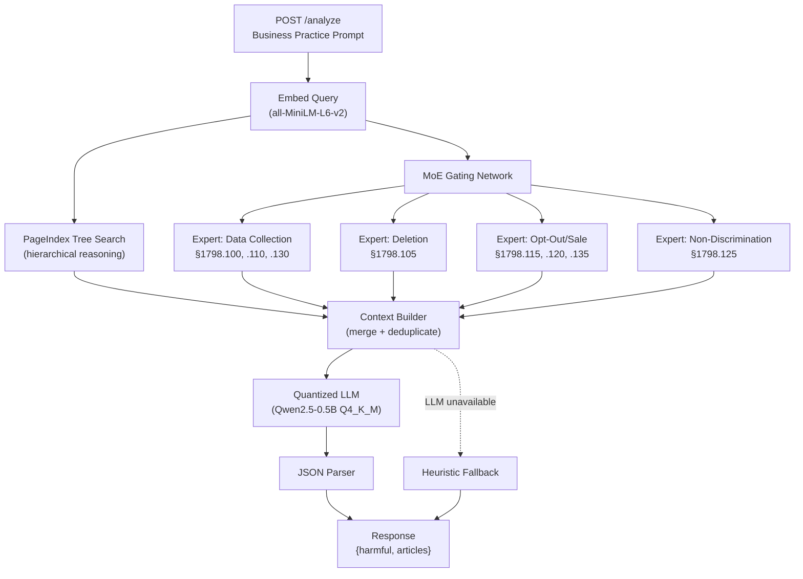

# CCPA Violation Detection System — Implementation Guide

## 1. System Overview

This system analyses natural-language business practices against the California Consumer Privacy Act (CCPA) and returns a structured JSON verdict. It combines three retrieval strategies:

| Layer | Technique | Purpose |
|---|---|---|
| **PageIndex** | Hierarchical tree search | Reasoning-based, vectorless retrieval |
| **MoE Experts** | Sparse gating → domain FAISS indices | Specialised vector retrieval per topic |
| **Heuristic Fallback** | Pattern-similarity matching | Guaranteed response when LLM fails |



---

## 2. PageIndex — Reasoning-Based Retrieval

Inspired by [VectifyAI/PageIndex](https://github.com/VectifyAI/PageIndex), this replaces pure vector similarity with a hierarchical tree-search.

### 2.1 How It Works

Traditional RAG chunks documents and searches by vector similarity. **PageIndex instead:**

1. **Builds a tree** from the CCPA statute (3 levels: Root → Domain Group → Section)
2. **Pre-computes embeddings** for every node's summary
3. **At query time**, traverses the tree top-down:
   - Scores each child node against the query via cosine similarity
   - Selects top-K children to explore (sparse routing)
   - Recurses into children until reaching leaf nodes
4. Returns leaf-node texts as retrieval context

### 2.2 Tree Structure

```
CCPA Statute (root)
├── Consumer Rights — Data Collection & Disclosure
│   ├── §1798.100 — Right to Know
│   ├── §1798.110 — Categories Collected
│   └── §1798.130 — Notice Requirements
├── Consumer Rights — Right to Deletion
│   └── §1798.105 — Right to Delete
├── Consumer Rights — Opt-Out of Sale
│   ├── §1798.115 — Disclosure of Sale
│   ├── §1798.120 — Right to Opt-Out
│   └── §1798.135 — Do Not Sell Link
├── Consumer Rights — Non-Discrimination
│   └── §1798.125 — Non-Discrimination
└── General Provisions
    ├── §1798.140 — Definitions
    ├── §1798.145 — Exemptions
    ├── §1798.150 — Data Breaches
    └── §1798.155 — Enforcement
```

### 2.3 Key Advantage Over Pure Vector Search

| | Vector RAG | PageIndex |
|---|---|---|
| Retrieval method | Flat cosine similarity | Tree-guided reasoning |
| Structure awareness | None (chunks are flat) | Full hierarchy preserved |
| Explainability | Opaque similarity scores | Traceable path through tree |
| Page references | Lost after chunking | Preserved at every node |

---

## 3. MoE — Mixture of Experts

### 3.1 Gating Network

The gating network computes cosine similarity between the query embedding and each expert's description embedding, then activates the **top-2** experts.

### 3.2 Expert Domains

| Expert | Sections | Keywords |
|---|---|---|
| Data Collection | §100, §110, §130 | collect, privacy policy, disclose, biometric |
| Deletion Rights | §105 | delete, erase, request, ignore |
| Opt-Out & Sale | §115, §120, §135 | sell, opt-out, broker, minor, consent |
| Non-Discrimination | §125 | price, discriminate, penalty, deny |

Each expert has its own FAISS sub-index containing only domain-relevant chunks, ensuring specialised retrieval.

---

## 4. Quantized LLM Engine

| Property | Value |
|---|---|
| Model | Qwen2.5-0.5B-Instruct |
| Format | GGUF Q4_K_M (~350 MB) |
| Runtime | llama-cpp-python (CPU) |
| Context | 2048 tokens |
| Temperature | 0.1 |

The LLM receives the merged context from PageIndex + MoE experts and produces a JSON classification using chain-of-thought reasoning.

---

## 5. Project Structure

```
ccpa_hackathon_package/
├── app/
│   ├── __init__.py
│   ├── config.py              # Centralised settings (env-var overrides)
│   ├── models.py              # Pydantic request/response schemas
│   ├── ccpa_knowledge.py      # Built-in CCPA statute (12 sections)
│   ├── pdf_processor.py       # PyMuPDF PDF extraction with page numbers
│   ├── chunker.py             # Section-aware overlapping chunker
│   ├── embeddings.py          # Sentence-transformers + ONNX quantization
│   ├── vector_store.py        # FAISS inner-product index
│   ├── page_index.py          # PageIndex tree builder + tree-search retriever
│   ├── moe_router.py          # MoE sparse gating network
│   ├── experts.py             # 4 domain expert modules
│   ├── llm_engine.py          # Quantized GGUF LLM via llama-cpp-python
│   ├── reasoning_rag.py       # Top-level pipeline orchestrator
│   └── main.py                # FastAPI app (/health, /analyze)
├── Dockerfile                 # Multi-stage, python:3.11-slim, models baked in
├── docker-compose.yml         # Codespaces-friendly (4 GB memory limit)
├── requirements.txt           # All Python dependencies
├── download_model.py          # Pre-downloads models during Docker build
├── ccpa_statute.pdf           # CCPA statute (provided)
└── validate_format.py         # Test harness (provided)
```

---

## 6. API Contract

### `GET /health`
```json
{"status": "ok"}
```

### `POST /analyze`
**Request:**
```json
{"prompt": "We sell customer data to brokers without opt-out."}
```
**Response:**
```json
{"harmful": true, "articles": ["Section 1798.120"]}
```

---

## 7. Build & Run

```bash
# Build the Docker image (downloads models during build)
docker compose build

# Start the container
docker compose up -d

# Wait for health check, then run tests
python validate_format.py

# View logs
docker compose logs -f

# Stop
docker compose down
```

---

## 8. Configuration

All settings are tuneable via environment variables in `docker-compose.yml`:

| Variable | Default | Description |
|---|---|---|
| `PAGEINDEX_ENABLED` | `true` | Enable PageIndex tree search |
| `PAGEINDEX_TOP_K` | `5` | Max leaf nodes returned per query |
| `TOP_K_EXPERTS` | `2` | MoE experts activated per query |
| `TOP_K_RETRIEVAL` | `5` | Chunks per expert |
| `SIMILARITY_THRESHOLD` | `0.25` | Min gate score to activate expert |
| `LLM_N_THREADS` | `4` | CPU threads for LLM inference |
| `LLM_TEMPERATURE` | `0.1` | LLM sampling temperature |
| `CHUNK_SIZE` | `512` | Chars per chunk |
| `CHUNK_OVERLAP` | `64` | Overlap between chunks |

---

## 9. Docker Optimisation

| Technique | Impact |
|---|---|
| `python:3.11-slim` base | ~150 MB (vs ~900 MB full) |
| Multi-stage build | Build tools excluded from runtime |
| CPU-only PyTorch | ~200 MB saved vs CUDA version |
| `--no-cache-dir` pip | No pip cache in image |
| Models baked in at build | Zero download at startup |
| Single uvicorn worker | Low memory footprint for Codespaces |
| HEALTHCHECK | Auto-restart on failure |

---

## 10. Pipeline Execution Flow

```
1. Startup
   ├── Load embedding model (all-MiniLM-L6-v2)
   ├── Load GGUF LLM (Qwen2.5 Q4_K_M)
   ├── Parse CCPA PDF + merge with built-in knowledge
   ├── Chunk sections → embed → add to FAISS
   ├── Create 4 experts → populate sub-indices
   ├── Register experts with MoE router
   ├── Build PageIndex tree → index all nodes
   └── Pre-compute fallback pattern embeddings

2. Per-request (/analyze)
   ├── Embed query
   ├── PageIndex: tree search → top-5 leaf nodes
   ├── MoE: gate scores → top-2 experts → retrieve chunks
   ├── Merge PageIndex + expert context (deduplicated)
   ├── LLM: chain-of-thought reasoning → JSON
   ├── Validate JSON structure
   └── (fallback) Heuristic pattern classifier
```
